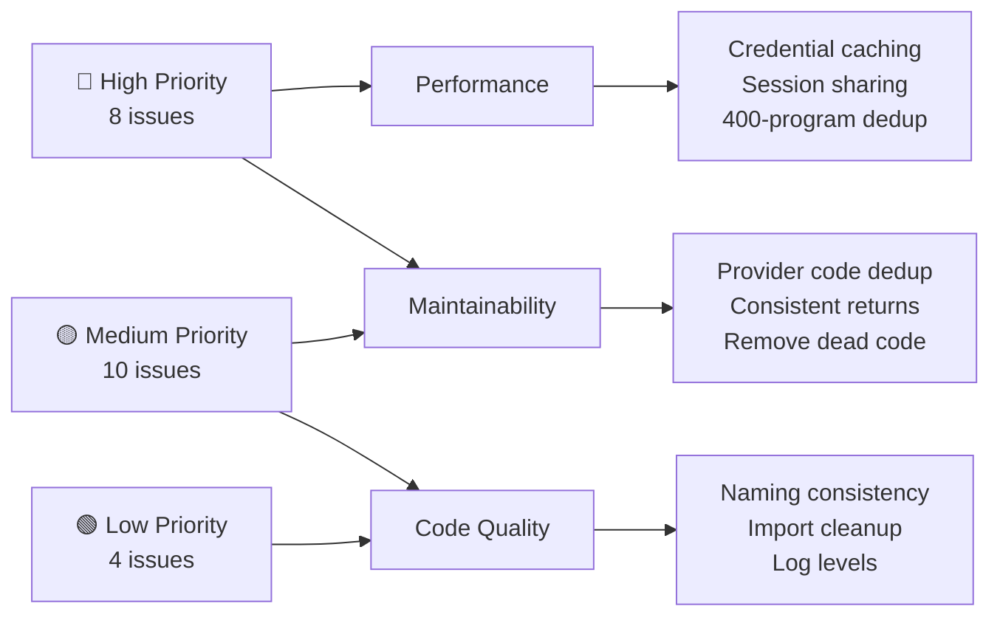

# Code Review: ReplayTV-Stremio

> Full review focused on **refactoring** and **efficiency improvements**. Security issues are explicitly excluded per request.

---

## Project Overview

A Python FastAPI-based Stremio addon providing catch-up TV replay and live streams from French (FranceTV, MyTF1, 6play) and Canadian (CBC Gem) providers. Well-structured with a `BaseProvider` abstraction, centralized config registry, and shared utilities.

**Overall assessment**: The architecture is solid with good abstractions. The main areas for improvement are **duplicated logic across providers**, **per-request object re-creation**, and **inconsistent patterns** between providers that should be unified.

---

## 🔴 High Priority

### 1. Provider instances re-created on every request — expensive re-authentication & session setup

**Files**: [catalog.py](file:///c:/Users/Phantom/Desktop/Projects/ReplayTV-Stremio/app/routers/catalog.py#L99), [meta.py](file:///c:/Users/Phantom/Desktop/Projects/ReplayTV-Stremio/app/routers/meta.py#L153), [stream.py](file:///c:/Users/Phantom/Desktop/Projects/ReplayTV-Stremio/app/routers/stream.py#L93)

Every API call does `ProviderFactory.create_provider(...)`, which:
- Creates a new `requests.Session` (new TCP connections)
- Creates a new `ProviderAPIClient` (another session with retry adapter)
- Loads `proxy_config` (re-reads `credentials.json` on first call per singleton)
- Loads `credentials` (reads file from disk or env each time)
- Loads `programs.json` (cached, but still dict lookups per call)

**Impact**: On a catalog request with 10 shows, `FranceTVProvider.__init__` is called once, but it creates 2 `requests.Session` objects (one in `BaseProvider` at line 61, one inside `ProviderAPIClient` via `RobustHTTPClient` at line 22 of http_utils.py). The `self.session` on `BaseProvider` and `self.api_client.session` are **separate** sessions that never share connections.

**Suggested fix**: 
- Pool or cache provider instances per-request (or across requests for short TTLs)
- At minimum, share a single `requests.Session` between the provider and its API client
- Make `load_credentials()` cache its result (currently reads file every time)

---

### 2. `load_credentials()` reads from disk on every call

**File**: [credentials.py](file:///c:/Users/Phantom/Desktop/Projects/ReplayTV-Stremio/app/utils/credentials.py#L77-L101)

`load_credentials()` is called from:
- Every `BaseProvider.__init__` (via `get_provider_credentials`)
- `_load_mediaflow_config()` (again via `get_provider_credentials`)
- `check_processed_file()` in `fr/common.py`
- `health` endpoint
- `startup_diagnostics`
- `debug_credentials`
- `CBCProvider._authenticate_if_needed`

Each call opens & parses `credentials.json` from disk or re-parses the env var. This is wasteful since credentials don't change at runtime.

**Suggested fix**: Cache the parsed credentials in a module-level variable with a simple sentinel pattern:
```python
_cached_credentials = None

def load_credentials() -> Dict[str, Any]:
    global _cached_credentials
    if _cached_credentials is not None:
        return _cached_credentials
    # ... existing loading logic ...
    _cached_credentials = creds
    return creds
```

---

### 3. Massive code duplication between `mytf1.py` (936 lines) and `sixplay.py` (1078 lines)

**Files**: [mytf1.py](file:///c:/Users/Phantom/Desktop/Projects/ReplayTV-Stremio/app/providers/fr/mytf1.py), [sixplay.py](file:///c:/Users/Phantom/Desktop/Projects/ReplayTV-Stremio/app/providers/fr/sixplay.py)

Despite a prior refactoring that created [fr/common.py](file:///c:/Users/Phantom/Desktop/Projects/ReplayTV-Stremio/app/providers/fr/common.py), significant duplication remains:

| Pattern | mytf1.py | sixplay.py |
|---------|----------|------------|
| ID extraction (`"episode:" in id → split`) | Lines 640, 317 | Lines 189-192, 235-238 |
| DRM processing block (`process_drm_simple`) | Lines 704-716 | Lines 373-397 |
| "Stream not available" placeholder dicts | Lines 768-781 | Lines 384-397 |
| `_safe_api_call` delegation | Lines 75-82 | Lines 124-133 |
| Manifest type detection (HLS vs MPD) | Lines 592-593, 666-667 | Lines 292-299 |
| N_m3u8DL-RE command printing | Lines 700-702 | Lines 631-632 (via `_print_download_command`) |

**Suggested fix**: Extract to `BaseProvider` or `fr/common.py`:
- `extract_episode_id(raw_id, marker="episode:")` → returns the actual episode ID
- `detect_manifest_type(url)` → returns `"hls"` or `"mpd"`
- `build_processing_placeholder(success: bool)` → returns the "stream not available" dict
- `trigger_drm_processing(url, episode_id, keys, ...)` → wraps the common DRM processing block

---

### 4. `_filter_available_episodes()` is a no-op

**File**: [mytf1.py](file:///c:/Users/Phantom/Desktop/Projects/ReplayTV-Stremio/app/providers/fr/mytf1.py#L422-L445)

```python
def _filter_available_episodes(self, episodes):
    available_episodes = []
    for episode in episodes:
        episode_id = episode.get('id', '').split(':')[-1]
        if not episode_id or episode_id.endswith('_fallback'):
            available_episodes.append(episode)
            continue
        try:
            available_episodes.append(episode)  # Always appends!
        except Exception:
            continue
    return available_episodes
```

This method iterates all episodes just to append them all — it's an identity function with overhead. The `try/except` wraps no throwing code. The blank lines 439-440 suggest unfinished work.

**Suggested fix**: Either implement the actual filtering logic or remove the method and the call at [line 387](file:///c:/Users/Phantom/Desktop/Projects/ReplayTV-Stremio/app/providers/fr/mytf1.py#L387).

---

### 5. Dual `requests.Session` per provider — wasted connections

**Files**: [base_provider.py](file:///c:/Users/Phantom/Desktop/Projects/ReplayTV-Stremio/app/providers/base_provider.py#L61-L71), [http_utils.py](file:///c:/Users/Phantom/Desktop/Projects/ReplayTV-Stremio/app/utils/http_utils.py#L22)

`BaseProvider.__init__` creates:
1. `self.session = requests.Session()` (line 61) — used by providers directly
2. `self.api_client = ProviderAPIClient(...)` (line 67) — which creates its own `self.session` via `RobustHTTPClient.__init__`

These two sessions have different configurations (the API client's has retry adapters; the base provider's doesn't). Providers mix both, e.g.:
- `sixplay.py` line 262: `self.session.get(...)` — no retry
- `sixplay.py` line 126: `self.api_client.safe_request(...)` — with retry

**Suggested fix**: Remove `self.session` from `BaseProvider` and have providers use `self.api_client.session` exclusively. Or pass the configured session from `api_client` as the provider's session.

---

### 6. `SixPlayProvider.resolve_stream()` overrides `BaseProvider.resolve_stream()` with near-identical logic

**Files**: [sixplay.py](file:///c:/Users/Phantom/Desktop/Projects/ReplayTV-Stremio/app/providers/fr/sixplay.py#L1050-L1077), [base_provider.py](file:///c:/Users/Phantom/Desktop/Projects/ReplayTV-Stremio/app/providers/base_provider.py#L223-L231)

`BaseProvider.resolve_stream` already handles the routing:
```python
def resolve_stream(self, stream_id):
    if ":channel:" in stream_id or stream_id.startswith("live_"):
        return self.get_channel_stream_url(stream_id)
    else:
        return self.get_episode_stream_url(stream_id)
```

`SixPlayProvider.resolve_stream` reimplements this with extra regex matching for bare IDs. Since `SixPlayProvider.supports_live = False` and `get_channel_stream_url` returns `None`, the live branch is dead code.

**Suggested fix**: Remove the override. If bare video ID support is needed, handle it in `get_episode_stream_url` instead.

---

### 7. `MyTF1Provider._build_stream_headers()` shadows `BaseProvider._build_stream_headers()`

**Files**: [mytf1.py](file:///c:/Users/Phantom/Desktop/Projects/ReplayTV-Stremio/app/providers/fr/mytf1.py#L84-L105), [base_provider.py](file:///c:/Users/Phantom/Desktop/Projects/ReplayTV-Stremio/app/providers/base_provider.py#L157-L168)

The base class has `_build_stream_headers(self, auth_token=None)`, but MyTF1 defines its own `_build_stream_headers(self, include_auth=True)` with a completely different signature and much more headers (Sec-Fetch-*, DNT, etc.). This violates Liskov substitution and makes the base method dead code for MyTF1.

**Suggested fix**: Either make the base method more extensible (accept `**extra_headers`) or rename MyTF1's method to clarify it's provider-specific. The extra browser-mimicking headers (Sec-Fetch-Dest, Sec-GPC, etc.) are unlikely to matter for API calls and add noise.

---

### 8. CBC provider has its own caching layer that duplicates the router-level caching

**File**: [cbc.py](file:///c:/Users/Phantom/Desktop/Projects/ReplayTV-Stremio/app/providers/ca/cbc.py#L139-L173)

CBC's `get_shows()`, `get_programs()`, `get_episodes()`, and `_get_show_episodes()` all manually check/set the global `cache` at the provider level. Meanwhile, the catalog router ([catalog.py](file:///c:/Users/Phantom/Desktop/Projects/ReplayTV-Stremio/app/routers/catalog.py#L129-L137)) and meta router ([meta.py](file:///c:/Users/Phantom/Desktop/Projects/ReplayTV-Stremio/app/routers/meta.py#L162-L166)) **also** cache programs and episodes.

This results in **double caching** with potentially different TTLs and cache keys (`"cbc_programs"` in the provider vs `"programs:cbc"` in the router). Also, `get_shows()` and `get_programs()` are nearly identical methods that both exist on CBC.

**Suggested fix**: 
- Remove provider-level caching; let the routers handle it consistently
- Delete `get_shows()` — it's redundant with `get_programs()` (never called externally)
- Align all providers to only return data and let routers cache

---

## 🟡 Medium Priority

### 9. Redundant/unused imports across providers

| File | Unused Import |
|------|--------------|
| [sixplay.py](file:///c:/Users/Phantom/Desktop/Projects/ReplayTV-Stremio/app/providers/fr/sixplay.py#L10-L14) | `time`, `random`, `uuid` (uuid only used in `_normalize_key_id`), `os` (only used in `_extract_widevine_key` where it's imported again at line 539) |
| [sixplay.py](file:///c:/Users/Phantom/Desktop/Projects/ReplayTV-Stremio/app/providers/fr/sixplay.py#L18) | `load_credentials` — never used directly (base class handles it) |
| [sixplay.py](file:///c:/Users/Phantom/Desktop/Projects/ReplayTV-Stremio/app/providers/fr/sixplay.py#L27) | `get_random_windows_ua` — imported but also available via `self.session` |
| [mytf1.py](file:///c:/Users/Phantom/Desktop/Projects/ReplayTV-Stremio/app/providers/fr/mytf1.py#L13) | `load_credentials` — never used directly |
| [mytf1.py](file:///c:/Users/Phantom/Desktop/Projects/ReplayTV-Stremio/app/providers/fr/mytf1.py#L18) | `ProviderAPIClient` — already created by base class |
| [francetv.py](file:///c:/Users/Phantom/Desktop/Projects/ReplayTV-Stremio/app/providers/fr/francetv.py#L11) | `time` — never used |

**Suggested fix**: Remove unused imports. Use a linter (`ruff` or `flake8`) in CI.

---

### 10. `_safe_api_call` wrapper methods are redundant delegation

**Files**: [mytf1.py](file:///c:/Users/Phantom/Desktop/Projects/ReplayTV-Stremio/app/providers/fr/mytf1.py#L75-L82), [sixplay.py](file:///c:/Users/Phantom/Desktop/Projects/ReplayTV-Stremio/app/providers/fr/sixplay.py#L124-L133)

Both providers define `_safe_api_call()` that simply delegates to `self.api_client`. This is a leftover from before the `ProviderAPIClient` extraction.

```python
# sixplay.py
def _safe_api_call(self, url, params=None, headers=None, data=None, method='GET', max_retries=3):
    return self.api_client.safe_request(method=method, url=url, ...)
```

Callers should use `self.api_client.get()` / `self.api_client.post()` directly.

**Suggested fix**: Replace all `self._safe_api_call(url, ...)` calls with `self.api_client.get(url, ...)` or `.post(...)` and delete the wrapper.

---

### 11. `_fetch_with_proxy_fallback` duplicated between base and MyTF1

**Files**: [base_provider.py](file:///c:/Users/Phantom/Desktop/Projects/ReplayTV-Stremio/app/providers/base_provider.py#L142-L155), [mytf1.py](file:///c:/Users/Phantom/Desktop/Projects/ReplayTV-Stremio/app/providers/fr/mytf1.py#L107-L129)

`BaseProvider` has a generic `_fetch_with_proxy_fallback`, but MyTF1 overrides it with nearly identical logic plus TF1-specific delivery validation (`delivery_country != 'US'`). The SixPlay provider doesn't use this method at all.

**Suggested fix**: Make the base method accept an optional validation callback:
```python
def _fetch_with_proxy_fallback(self, url, params, headers, 
                                proxy_key='fr_default', 
                                validate=None):
    # ... proxy attempt ...
    if validate and not validate(data):
        # fall through to direct
    # ... direct attempt ...
```

---

### 12. `FranceTVMetadataProcessor` is tightly coupled to FranceTV but used as a global

**File**: [metadata.py](file:///c:/Users/Phantom/Desktop/Projects/ReplayTV-Stremio/app/providers/fr/metadata.py)

The class stores `self.api_mobile` and `self.api_front` URLs but never uses them (the provider has its own copies). It also has methods like `get_show_metadata()` and `get_episode_metadata()` that are generic enough to be used by any provider, yet the class name says "FranceTV".

The meta router also imports from a non-existent module:
```python
# meta.py line 184
from app.utils.metadata import metadata_processor  # Wrong path!
```
The actual module is at `app.providers.fr.metadata`.

**Suggested fix**: 
- Remove the unused `self.api_mobile` / `self.api_front` from the processor
- Rename to `MetadataProcessor` (drop "FranceTV" prefix) since it's generic
- Fix the import path in `meta.py`

---

### 13. Log-level mismatch: `logger.info` used for debug-level operational noise

**Files**: Multiple, especially [cbc.py](file:///c:/Users/Phantom/Desktop/Projects/ReplayTV-Stremio/app/providers/ca/cbc.py), [catalog.py](file:///c:/Users/Phantom/Desktop/Projects/ReplayTV-Stremio/app/routers/catalog.py), [main.py](file:///c:/Users/Phantom/Desktop/Projects/ReplayTV-Stremio/app/main.py#L87-L89)

Many messages use `logger.info` that should be `logger.debug`:
- `main.py:88`: Logging all request headers at INFO level
- `cbc.py:89`: IP forwarding notices
- `catalog.py:94`: Cache hit messages
- `stream.py:75`: Every live stream request

The middleware at [main.py:87-89](file:///c:/Users/Phantom/Desktop/Projects/ReplayTV-Stremio/app/main.py#L87-L89) logs **every request's full headers** at INFO level, which is extremely noisy in production.

**Suggested fix**: Demote operational/routing messages to `logger.debug`. Reserve `logger.info` for significant state changes (auth success, first-time cache population, etc.).

---

### 14. `get_episode_stream_url` inconsistent return types across providers

| Provider | Return type |
|----------|------------|
| FranceTV | `Optional[Dict]` — single dict |
| SixPlay | `Optional[Dict]` or `List[Dict]` (line 293) or single dict (line 426) |
| MyTF1 | `List[Dict]` (line 789) or single dict (line 861) |
| CBC | `Optional[Dict]` — single dict |

The `stream.py` router handles both cases ([line 63-70](file:///c:/Users/Phantom/Desktop/Projects/ReplayTV-Stremio/app/routers/stream.py#L63-L70)), but this polymorphic return type makes reasoning harder and TypedDict annotations meaningless.

**Suggested fix**: Always return `List[StreamInfo]` from `get_episode_stream_url`. Wrap single results in a list at the provider level.

---

### 15. `test_francetv_provider()` embedded in production code

**File**: [francetv.py](file:///c:/Users/Phantom/Desktop/Projects/ReplayTV-Stremio/app/providers/fr/francetv.py#L652-L707)

The `test_francetv_provider()` function and `if __name__ == "__main__"` block at the end of the production module add 55 lines of dead code that gets imported with every request.

**Suggested fix**: Move to `tests/test_francetv_integration.py`.

---

### 16. `safe_print` used alongside `logger` — redundant dual output

**Files**: [api_client.py](file:///c:/Users/Phantom/Desktop/Projects/ReplayTV-Stremio/app/utils/api_client.py), [http_utils.py](file:///c:/Users/Phantom/Desktop/Projects/ReplayTV-Stremio/app/utils/http_utils.py), [programs_loader.py](file:///c:/Users/Phantom/Desktop/Projects/ReplayTV-Stremio/app/utils/programs_loader.py)

`safe_print()` writes to stdout, while `logger` also writes to stdout (via the `StreamHandler` in main.py). Many callsites use both:
```python
safe_print(f"❌ [{self.provider_name}] Unexpected error: {e}")
# ... and also ...
logger.error(f"{context} - API call failed: {e}")
```

This produces duplicate output for every error.

**Suggested fix**: Eliminate `safe_print` entirely and use only `logger`. The original motivation (Unicode safety) is handled by the logging formatter's encoding.

---

### 17. `ProxyConfig` singleton reads credentials file independently of `load_credentials()`

**File**: [proxy_config.py](file:///c:/Users/Phantom/Desktop/Projects/ReplayTV-Stremio/app/utils/proxy_config.py#L40-L56)

`ProxyConfig.load_proxies()` opens and parses `credentials.json` separately from `load_credentials()`. The same file is parsed twice on startup.

**Suggested fix**: Have `ProxyConfig` consume the already-parsed credentials dict:
```python
def load_proxies(self):
    from app.utils.credentials import load_credentials
    creds = load_credentials()
    self.proxies = creds.get('proxies', {})
```

---

### 18. `_get_show_api_metadata` in MyTF1 makes a 500-program GraphQL query just for one show's poster

**File**: [mytf1.py](file:///c:/Users/Phantom/Desktop/Projects/ReplayTV-Stremio/app/providers/fr/mytf1.py#L872-L934)

The `_get_show_api_metadata` method fetches up to 500 programs from the GraphQL API, then iterates to find the matching show name — for every single show in `get_programs()`. With thread-parallel fetching, this means **N simultaneous queries of 500 programs each** just to get posters.

The same 500-program fetch is also done in `get_episodes()` ([line 354-364](file:///c:/Users/Phantom/Desktop/Projects/ReplayTV-Stremio/app/providers/fr/mytf1.py#L354-L364)), so the same data is fetched twice per show.

**Suggested fix**: Fetch the 500-program list once, cache it, and look up individual shows from the cached list. This would reduce N API calls to 1-2.

---

## 🟢 Low Priority / Code Quality

### 19. Inconsistent naming conventions for similar concepts

| Concept | mytf1.py | sixplay.py | cbc.py |
|---------|----------|------------|--------|
| Check processed file | `_check_processed_file_locations()` | `_check_processed_file()` | (not applicable) |
| Get show metadata | `_get_show_api_metadata()` | `_get_show_api_metadata()` | (N/A) |
| Wrapper for safe API | `_safe_api_call()` | `_safe_api_call()` | (uses http_client directly) |
| Get shows | `get_programs()` | `get_programs()` | `get_programs()` + `get_shows()` |

### 20. `datetime` imported inside function body

**File**: [francetv.py](file:///c:/Users/Phantom/Desktop/Projects/ReplayTV-Stremio/app/providers/fr/francetv.py#L558)

```python
from datetime import datetime  # Inside _parse_episode()
```

This import runs on every episode parse call. Move to module top-level.

### 21. `traceback` imported inside except blocks

**Files**: [francetv.py:388](file:///c:/Users/Phantom/Desktop/Projects/ReplayTV-Stremio/app/providers/fr/francetv.py#L388), [mytf1.py:867](file:///c:/Users/Phantom/Desktop/Projects/ReplayTV-Stremio/app/providers/fr/mytf1.py#L867), [cbc.py:656](file:///c:/Users/Phantom/Desktop/Projects/ReplayTV-Stremio/app/providers/ca/cbc.py#L656)

`traceback` is a stdlib module that's already imported at the top of `main.py`. Import it once at the module level.

### 22. Magic strings for cache keys in CBC

CBC uses raw string keys like `"cbc_shows"`, `"cbc_programs"`, `"cbc_auth_status"` while the rest of the app uses `CacheKeys`. This inconsistency means renaming a key pattern requires searching multiple files.

---

## Summary of Changes by Impact



### Estimated impact if all refactoring applied:
- **~400 lines removed** across providers (duplicate code elimination)
- **~60% fewer HTTP sessions** created per request cycle
- **~70% fewer disk reads** for credentials.json
- **Clearer provider contract** with consistent return types
